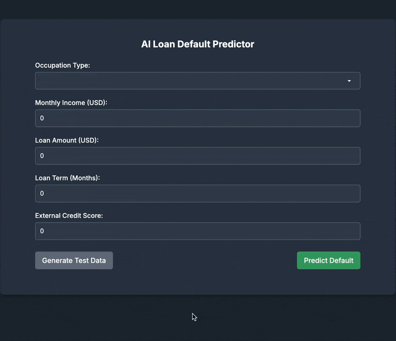

# AI Loan Default Predictor App

An end-to-end machine learning application that predicts loan default risk using real applicant data.  
Built with a Flask API serving a LightGBM model, and an Angular frontend for interactive input and real-time prediction.

> Deployed Live: [ai.fullstackista.com/ai-loan-default-predictor](https://ai.fullstackista.com/ai-loan-default-predictor)

---

## Project Overview

This project is based on the [Home Credit Default Risk](https://www.kaggle.com/competitions/home-credit-default-risk) Kaggle competition dataset.  
It demonstrates how machine learning can assist financial institutions in assessing risk and making informed lending decisions.

The app is designed to simulate a **real-world loan risk prediction tool**, allowing users to:

- Input applicant details
- Trigger the ML model
- View the probability of default

---

## Machine Learning Model

- Model: **LightGBM**
- AUC achieved: **0.7807** (Kaggle leaderboard quality)
- Trained on: processed and feature-engineered Kaggle dataset
- Feature engineering includes:
  - Aggregated credit activity and overdue metrics
  - Loan amount and repayment behavior features
  - Time-based features (e.g., loan age, recency)
  - Categorical feature transformations
  - Merging auxiliary datasets (bureau, POS, credit card, installments, etc.)

---

## Tech Stack

| Layer        | Tech                       |
|--------------|----------------------------|
| Frontend     | Angular (HTML, CSS, TS)    |
| Backend API  | Flask (Python)             |
| ML Model     | LightGBM (via joblib)      |
| Hosting      | AWS                        |

---

## Key Features

- Clean form-based UI to simulate user loan application
- Live risk score prediction using a trained LightGBM model
- Simple interface to demonstrate model predictions and workflow
- Deployed for demo purposes on AWS

---

## Demo

---

## Live Demo

  [ai.fullstackista.com/ai-loan-default-predictor](https://ai.fullstackista.com/ai-loan-default-predictor)

---

## 🧪 Try It Yourself

1. Go to the link above
2. Fill out a sample application form
3. Submit and view the predicted default probability

No sign-up or login required.

---

## Future Improvements

- Integrate SHAP or similar tools to explain individual predictions
- Optionally visualize key feature contributions within the app interface

---

## About the Author

Built by a C-level banking executive with 20+ years of experience in finance, now leading end-to-end AI implementation projects.  
Learn more at [fullstackista.com → About](https://www.fullstackista.com/about-us)
